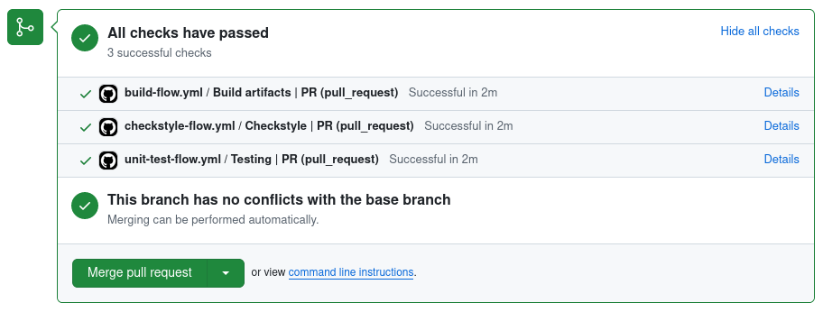

# Description

Backend v2

# Features

## CI / CD

### Pre-merge checks pipeline

При создании pull-request в trunk вызываются обязательные прекоммитные проверки.

> #### Checkstyle
> Проверка кодстайла с помощью detekt

> #### Testing
> Прогон тестов с помощью JUnit5

> #### Build
> Сборка .jar файла приложения

# Utils

> **ASCII art** \
> [Конструктор текстовых изображений](https://patorjk.com/software/taag/#p=display&f=Big)
